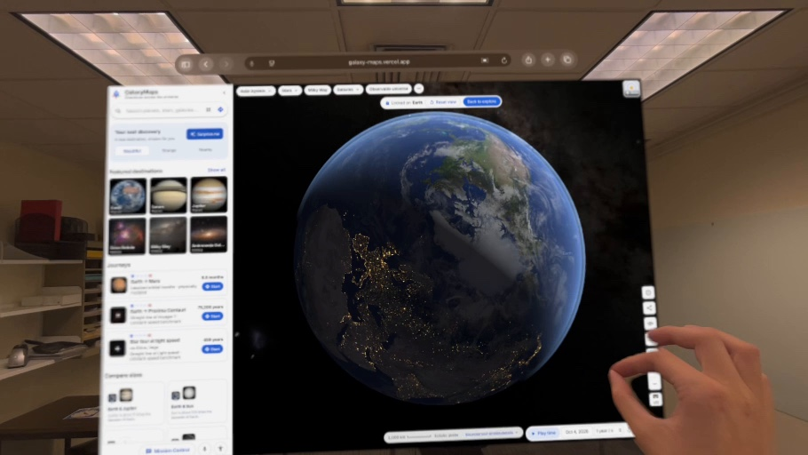
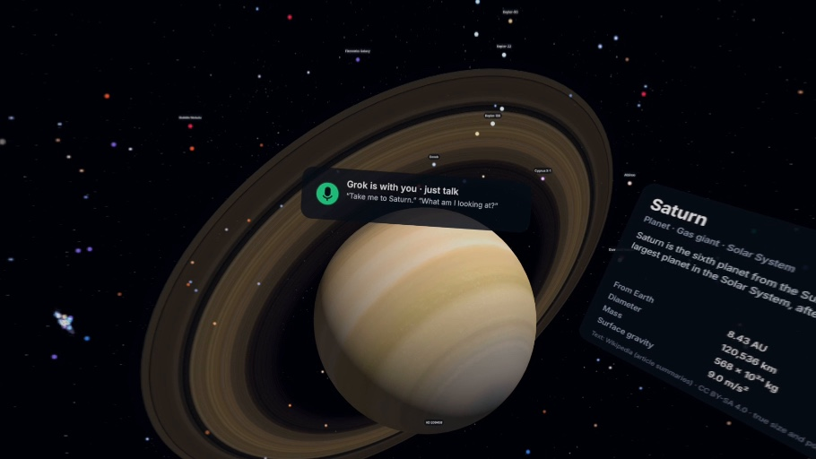
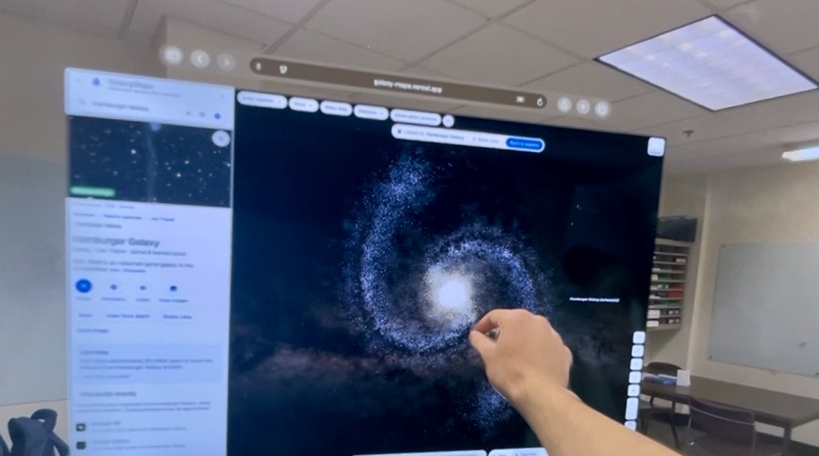

# Cursor: build the final GalaxyMaps slide decks

## Your task

Create the finished presentation files now using this prompt, the three included Vision Pro images, and the actual GalaxyMaps project in this workspace. Produce the deck artifacts, not just advice or an outline. Work autonomously on ordinary design and screenshot choices. Keep the app itself unchanged.

The user has edited the cover tagline to **Navigate the universe.** This wording is authoritative. Use it exactly, including the period, in both covers. Use the exact first-round slide copy and speaker script below. Later changes in this prompt take precedence over the older reference PDF.

## Deliverables

1. `GalaxyMaps-Round-One.pptx`: 5 main slides, followed by relevant backup slides. Target 1:50, hard limit 2:00.
2. `GalaxyMaps-Round-One.pdf`: same content with useful static frames.
3. `GalaxyMaps-Finalist.pptx`: 7 main slides, followed by relevant backup slides. Target 3:45, hard limit 4:00.
4. `GalaxyMaps-Finalist.pdf`: same content with useful static frames.
5. Put timed narration in the speaker notes, and include a separate `Speaker-Notes.md` for easy rehearsal.

Keep all text editable in PowerPoint. Embed the images, rather than linking to local paths. Save outputs in a dedicated presentation output folder. Use the available presentation tools in your environment. Render every slide and inspect the finished slides for clipping, readability, and composition. Report any concrete limitation rather than claiming an export or check succeeded when it did not.

The two-minute Q&A happens after each pitch, so it is not part of the script. This is a table presentation in round one. Optimize for readable images on a laptop and a confident, natural delivery.

## Included image assets and placement

All three images must appear in each delivered deck, either in the main presentation or its backup slides. They are original user-supplied captures. Use the copies below without changing their depicted content. These stills are sufficient to complete the presentation. Do not wait for a video or ask for the same assets again.

| Asset | What the image shows | Placement |
|---|---|---|
| `assets/02_VisionPro_Immersive_Saturn_Grok.jpeg` | An immersive Saturn scene with a Grok microphone HUD and an in-world Saturn information panel | Main slide 3, large. Use as the genuine headset view accompanying the Grok explanation. |
| `assets/01_VisionPro_Earth_Hand.jpeg` | Earth in a floating browser window, a classroom/room visible around it, and a hand making a pinch gesture | Main slide 4 in round one / slide 5 in finals. Main visual for “Space, from your classroom.” |
| `assets/03_VisionPro_Galaxy_Hand.jpeg` | A galaxy in a floating browser window with the room and a hand gesture visible | A dedicated VR backup slide in both decks, titled “Exploring in Apple Vision Pro.” Add a small secondary image on the classroom slide only if the composition stays clean. |

The two windowed captures show GalaxyMaps in the Vision Pro spatial browser. The Saturn capture shows the immersive view. Preserve that distinction in labels. A visible Grok HUD establishes that the interface is present; it does not by itself prove a completed spoken command. If capturing a fresh command/result example is possible, use it alongside this genuine screenshot within the same slide and time budget. Otherwise use the provided screenshot without inventing dialogue or claiming a live response.

Keep the hands, spatial-window borders, and useful room context in the windowed images. Do not crop so tightly that they look like ordinary desktop screenshots. On the Saturn image, retain the Grok HUD and enough of the information panel to show that it is the application. Do not transcribe partly clipped numerical details into slide claims.

Use these images at their original aspect ratios. They are about 910 pixels wide, so keep overlaid slide text crisp and editable; do not depend on tiny captured UI text being legible. Do not use generative enhancement, replace objects, invent hands, or fake sharper UI. Mild cropping for layout is fine if it preserves the evidence.

### Image previews

**Spatial browser: Earth and hand gesture**

**Immersive view: Saturn and Grok HUD**

**Spatial browser: galaxy and hand gesture**

## Other screenshots to capture yourself

Choose the best real app views from the working checkout or https://www.galaxies.wiki/. Capture a new desktop Earth/Saturn hero, Earth-to-Polaris directions, the Voyager 1 comparison, a readable route-source view, and the Demo-2 story. Use genuine product states. Do not reuse the supplied VR images as the cover if a fresh desktop hero can make each main slide visually distinct.

Use the existing project logo. Get official event/tool logos only if readily available; the small text credits specified below are a complete fallback. Do not spend the build searching for unnecessary decorative assets. Prioritize a beautiful finished deck and the actual product evidence.

If a live page cannot render or load, try the working local project. The included `reference/Previous-Deck.pdf` is the previous design/content reference and a fallback source of real screenshots; it does not override this prompt's copy or current facts. Do not fabricate missing product states.

## Final production checks

- Preserve the exact edited tagline and all four names.
- Round one has exactly 5 main slides; finals has exactly 7 main slides. Backup slides follow the closing slide and are excluded from timed delivery.
- Use every supplied image at least once per deck, with the roles above.
- Name the actual accessibility options and say “compatible WebXR headsets.”
- Represent Grok as the app integration, Cursor as the build tool, and SpaceX as mission/spacecraft content.
- Keep slide text short. Keep implementation notes, evidence labels, and these instructions out of audience-facing slides.
- Put detailed feature coverage and sources into notes/backups. Verify code-dependent claims in the current project.
- Include the classroom point, clear navigation theme, technical substance, and a readable URL/QR closing.
- Finish a static version even if no video is available. No empty media boxes or “insert screenshot here” placeholders.
- Verify the QR target and embedded assets, inspect the rendered slides, and check the scripts against the time budgets.

---

# Presentation copy and production requirements

Prepared for BigRed//Hacks 2026. This is the slide copy, presentation script, feature inventory, and production brief for Cursor. It does not change the application.

## Presentation decision

Build two clean, cinematic presentations from the same visual system:

- Round one: **5 main slides, target 1:50**, leaving 10 seconds before the 2:00 limit. Questions follow separately.
- Finalist round: **7 main slides, target 3:45**, leaving 15 seconds before the 4:00 limit. The team reports approximately two minutes for questions.
- Put the comprehensive feature inventory and technical detail after the closing slide as backup material. Do not advance into the appendix during the timed pitch.
- Use one narrator and one demo operator in round one. Show every team member's name on the cover. Assign Q&A topics according to who actually worked on each part.
- Keep the product on screen for most of the presentation. Use real screenshots and short recordings from the working application.
- Tell the team's actual story: you thought navigating space would be cool, and wanted people to learn through exploration.

Team: **TWRD**

**Teddy Lampert, Yijun Wang, Raj Iyer, Diyar Niyazov**

Product: **GalaxyMaps**

Public URL: **https://www.galaxies.wiki/**

## Exact round-one slide copy

Only the content marked “On slide” belongs on the slides. Speaker scripts, timings, production directions, and verification notes belong in presenter notes or this brief.

### Slide 1: GalaxyMaps

**Timing: 0:00–0:14**

**On slide**

> GalaxyMaps
>
> Navigate the universe.
>
> TWRD
>
> Teddy Lampert, Yijun Wang, Raj Iyer, Diyar Niyazov

Small event credit:

> BigRed//Hacks 2026  
> Major League Hacking

Small product credits, each with its own clear relationship:

> Built with Cursor  
> Voice navigation with Grok  
> SpaceX mission stories

**Visual**

One large, beautiful, genuine Earth or Saturn screenshot from GalaxyMaps. Leave clear space for the title. Preserve the actual GalaxyMaps logo. Keep the event and product credits in a restrained footer. Names and credits can be smaller than the pitch copy, but must remain readable. Do not put five large logos across the top.

**Say**

> We’re TWRD. We thought it would be cool to navigate through space. So we built GalaxyMaps: a familiar map that helps people explore space and understand what they’re looking at.

**Purpose**

The judges understand the product, navigation theme, and team immediately. Preserve the user’s exact cover tagline: “Navigate the universe.”

### Slide 2: Earth to Polaris

**Timing: 0:14–0:42**

**On slide**

> Earth to Polaris
>
> 433 years
>
> at the speed of light

Small caption:

> Compare with Voyager 1

Scientific caption, legible but subordinate:

> Approximate constant-speed comparison

**Visual**

A real Earth-to-Polaris route screenshot with both endpoints, the route, and the travel-time panel legible. A second frame may show Voyager 1 selected. If using a route recording, show one short, smooth journey segment. Keep the numerical comparison visible long enough to read.

**Say**

> Search for a destination and get directions. Here’s Earth to Polaris. At light speed, this distance takes about 433 years. At Voyager 1’s speed, it takes millions. You can compare the trips and watch the journey. That’s how we make scale easier to grasp.

**Demo direction**

Preload the route. Switch modes once if reliable, or show the two genuine recorded states. The live interface inspected for this brief displayed approximately 433 light-years, 433 years at light speed, and ±6.4 light-years of distance uncertainty. Use the current route output when recording, and update slide text if it differs materially.

**Purpose**

Shows navigation, a familiar interface, and an educational payoff with a single concrete example.

### Slide 3: “Show me Saturn.”

**Timing: 0:42–1:08**

**On slide**

> “Show me Saturn.”
>
> Grok moves the map and answers questions along the way.

Small technical line:

> Distances and travel times calculated by the app

**Visual**

One genuine command-and-result recording or screenshot sequence. Keep the actual Mission Control panel visible and show the resulting Saturn view. The result must be visually obvious. Include text captions so the example works in a noisy room.

**Say**

> Grok lets you control the map by voice. Ask it to show Saturn, compare planets, or start a tour. It calls validated tools in our Three.js app, while our code calculates the distances and travel times. We built the app with Cursor.

**Demo direction**

Use a previously tested command. Prefer a short recording during the timed pitch if response latency is unpredictable. Label a recording “Recorded demo.” Keep a ready result frame as backup. A connected badge alone is not evidence that a command worked.

**Purpose**

Proves a meaningful Grok integration, adds technical detail, and names Cursor without turning the slide into an advertisement.

### Slide 4: Space, from your classroom

**Timing: 1:08–1:37**

**On slide**

> Space, from your classroom
>
> A browser or a compatible VR headset

Supporting text:

> Voice and keyboard navigation  
> Spoken descriptions  
> Larger text, high contrast, reduced motion

Small label on the VR visual:

> Apple Vision Pro demo

**Visual**

The team's actual Apple Vision Pro capture should dominate this slide. Choose a frame that shows immersion and a recognizable object, with a hand interaction or in-world control if visible. If video is available, use an 8–10 second excerpt. The presenter can speak over it. A screenshot alone must not be described as demonstrating smooth motion.

**Say**

> The same map runs in compatible WebXR headsets. Here’s our Vision Pro demo. You can also explore in a browser, with keyboard controls, spoken descriptions, high contrast, and reduced motion. That gives more students a way in, even without a headset.

**Production condition**

Three actual Vision Pro screenshots are included in assets/ and have been inspected. Use the asset placements at the start of this prompt. These still images are sufficient to finish the decks now. A video is optional, not a dependency. Do not export unresolved placeholders.

**Purpose**

Makes the classroom use concrete and demonstrates accessibility through actual product controls.

### Slide 5: Where would you go?

**Timing: 1:37–1:50**

**On slide**

> Where would you go?
>
> galaxies.wiki
>
> TWRD

**Visual**

A different clean product view, preferably the strongest wide view of space. Place a tested QR code for https://www.galaxies.wiki/ beside the short domain. Keep the URL readable without scanning. Avoid adding a new feature collage.

**Say**

> We want a student to ask a question about space and explore the answer. That’s our take on navigation. We’re TWRD, and this is GalaxyMaps.

**Purpose**

Ends with a clear educational purpose, returns to the theme, and gives judges a memorable way to try the product.

## Round-one timing

| Slide | Slot | Main evidence |
|---|---:|---|
| GalaxyMaps | 0:00–0:14 | Product identity and team |
| Earth to Polaris | 0:14–0:42 | Route and travel comparison |
| “Show me Saturn.” | 0:42–1:08 | Grok command and visible result |
| Space, from your classroom | 1:08–1:37 | Vision Pro capture and access options |
| Where would you go? | 1:37–1:50 | Purpose and URL |
| Buffer | 1:50–2:00 | Transitions or a brief delay |

The script contains **182 spoken words** before incidental demo audio. At roughly 125–135 words per minute, it leaves room for visual pauses. Count any audible Grok response inside the allotted slide time. Rehearse the combined narration, media, and clicks with a stopwatch. These are budgets, not a guarantee of the team's delivery time.

If running behind, drop the Voyager mode switch and shorten the Grok recording. Keep the classroom point and the closing line. Do not speed-read to recover time.

## Finalist version

Use the same opening, route, Grok, classroom, and closing designs. Add two slides: **Under the map** and **Demo-2: launch to homecoming**. Expand the narration rather than adding text to every slide.

### Finalist slide order and script

| Slide | Slot |
|---|---:|
| 1. GalaxyMaps | 0:00–0:18 |
| 2. Earth to Polaris | 0:18–0:57 |
| 3. “Show me Saturn.” | 0:57–1:32 |
| 4. Under the map | 1:32–2:08 |
| 5. Space, from your classroom | 2:08–2:48 |
| 6. Demo-2: launch to homecoming | 2:48–3:13 |
| 7. Where would you go? | 3:13–3:45 |
| Buffer | 3:45–4:00 |

#### 1. GalaxyMaps

> We’re TWRD: Teddy, Yijun, Raj, and Diyar. We thought it would be cool to navigate through space. We wanted a way for people to explore space and understand what they’re looking at. This is GalaxyMaps. Navigate the universe.

#### 2. Earth to Polaris

> Here’s a trip from Earth to Polaris. Search for a destination, choose how you’d travel, and the map shows the route. At light speed, this distance takes about 433 years. At Voyager 1’s speed, it takes millions. You can add stops and watch a compressed journey. The travel time stays separate from the animation, so ten seconds on screen never means ten seconds in space.

Show the route, one mode change, and a short journey excerpt within this slot.

#### 3. “Show me Saturn.”

> Grok gives you another way to explore. You can ask it to show Saturn, compare Earth and Jupiter, or start a nebula tour. It can change the map through validated app tools and explain the objects you’re looking at. Our code supplies the distances and travel times. We used Cursor to build and iterate on the app.

Show one successful command. Do not run several unpredictable requests in sequence.

#### 4. Under the map

**On slide**

> Under the map
>
> Astronomy data and route math power every trip.

Four short labels:

> Precise 3D positions  
> Camera-relative rendering  
> Separate travel models  
> Validated Grok tools

Small stack credit:

> React, TypeScript, Three.js, WebXR

**Visual**

Use a legible product screenshot showing route “Sources and model details,” with a smaller, different view of the same destination if useful. An optional simple editable architecture diagram belongs in backup if it would crowd the slide. Avoid a dense grid of stack logos.

**Say**

> The engineering challenge is scale. We’re working with objects inside the Solar System and stars hundreds of light-years away. We keep positions in high precision and render relative to the camera. Route calculations stay separate from the display. We also distinguish constant-speed comparisons from idealized orbital transfers. That lets us explain what a number means, show its source, and keep the visual journey understandable.

**Evidence note**

The supplied PDF documents high-precision ICRF coordinates, camera-relative rendering, TypeScript calculations, Three.js, and shared WebXR rendering. Cursor should confirm those details in the current repository before putting them in the final speaker notes. Do not invent performance improvements, frame rates, test coverage, or a personal debugging story.

#### 5. Space, from your classroom

> WebXR brings the same map into compatible headsets. This is our Apple Vision Pro demo. For a class without headsets, there’s still the browser experience. We’ve included keyboard navigation, spoken descriptions, larger text, high contrast, and reduced motion. Those options give students different ways to use the map. Accessibility is something we want to keep testing with the people who need it.

Use the supplied Vision Pro stills within this time allocation. If a real recording is available in the project, an 8–10 second excerpt is optional. The Earth and galaxy stills show spatial browser windows; the Saturn still shows an immersive scene. Label them accordingly.

#### 6. Demo-2: launch to homecoming

**On slide**

> Demo-2: launch to homecoming
>
> Five chapters from the real mission

Supporting text:

> NASA photographs and source links  
> SpaceX spacecraft profiles

**Visual**

Use the actual GalaxyMaps mission-story interface, ideally a launch or docking chapter with a strong photograph and its source credit preserved. This is an educational mission story, not a flight-trajectory replay.

**Say**

> We also bring human spaceflight into the experience. Our Demo-2 story follows the mission through five chapters, with NASA photographs and source links. You can explore Falcon 9, Dragon, and Starship profiles alongside it. It connects the places on the map to real missions people recognize.

**Evidence note**

The live interface shows a five-chapter Demo-2 story, credits NASA photographs, links contemporary reports, and explicitly states that it does not claim a flight trajectory.

#### 7. Where would you go?

> Picture a class comparing a trip to Mars with a trip to Polaris. Students predict which takes longer, change the travel mode, and explain what they found. That’s the learning experience we want to test with students and teachers. Our take on navigation is helping people find their way through space and understand it as they go. GalaxyMaps is at galaxies.wiki.

The classroom scenario is a proposed use and evaluation plan, not a claim of deployment or demonstrated learning gains.

The finalist script contains **393 spoken words** before demo audio. Keep the timed run to 3:45 in rehearsal, with the hard stop at 4:00.

## Coverage of the judging criteria

Show evidence for each criterion. The criteria names belong in planning notes, not as five competing labels on the cover.

| Criterion | What judges should see or hear | Where |
|---|---|---|
| Technical skill | Grok tool control, code-calculated routes, shared 3D/WebXR experience; deeper coordinate and rendering explanation in finals | Round-one slides 3–4; finalist slide 4 |
| Design | Familiar search and directions, legible route statistics, restrained visual presentation, practical access settings | Slides 2–4 |
| Creativity | A maps interface for space, conversational exploration, and the ability to enter the map in VR | Slides 1–4 |
| Impact | A specific classroom activity, multiple ways to navigate, and a concrete plan to evaluate learning | Slides 4–5; finalist closing |
| Theme | Origin, destination, route, travel mode, stops, and a guided journey | Opening, route demo, closing |

## Feature inventory

This is the comprehensive inventory supported by the interface inspected for this brief and the supplied PDF. It is not a claim that every feature has been tested end to end. Cursor must reconcile it with the current repository, add any missing implemented features, and remove or relabel anything unavailable.

**Evidence key**

- **UI:** Control or content inspected in the deployed interface.
- **Calculated:** The deployed interface produced the stated route result.
- **Deck:** Documented in the supplied PDF; implementation should be checked in the current code.
- **Footage needed:** Actual headset behavior must be supported by the team's capture or device test.

### Exploration and discovery

- Search destinations with suggestions and category context. **UI**
- Browse Solar System bodies, stars and systems, compact objects, clusters, nebulae, galaxies, large-scale structures, spacecraft, and missions. **UI**
- Featured destinations including Earth, Saturn, Jupiter, Orion Nebula, the Milky Way, and Andromeda. **UI**
- “Surprise me” discovery with Beautiful, Strange, and Nearby preferences. **UI**
- Saved places and recently explored destinations. **UI**
- Destination photographs and descriptive information. **UI / Deck**
- A continuous 3D atlas across astronomical scales. **Deck**
- Realistic and Atlas layers. **UI command and keyboard descriptions / Deck**
- Home view, panning, zooming, object lock/orbit, and route fitting. **UI keyboard descriptions / Deck**
- Simulation time playback. **UI keyboard and voice descriptions / Deck**
- Shareable map state through URLs. **UI URL behavior / Deck**
- Earth sky chart. **Deck**

### Directions and travel

- Start and destination search, reverse direction, and additional stops. **UI**
- Light-speed and Voyager 1 travel comparisons. **UI**
- Earth-to-Polaris distance and approximate travel-time calculation. **Calculated**
- Distances displayed in light-years and parsecs for the Polaris route. **Calculated**
- Voyager 1 speed labeled with its date and source in the travel-mode menu. **UI**
- Travel time expressed as a human-lifetime comparison. **Calculated**
- Distance uncertainty. **Calculated**
- Suggested stops with additional distance and percentage detour. **Calculated**
- Journey launch and a separate preview playback control. **UI**
- Journey progress slider. **UI**
- Selectable 5, 10, 20, or 40 second preview duration. **UI**
- The interface distinguishes preview duration from physical travel time. **UI**
- Simulation time pauses during the route preview. **UI explanatory text**
- Earth-to-Mars idealized orbital transfer, approximately 8.5 months in the inspected journey card. **UI**
- Orbital-transfer details including delta-v and a transfer-window estimate. **Deck**
- Separate straight-line benchmark and idealized Hohmann models. **UI / Deck**
- Route sources and model-details disclosure. **UI**
- No numerical routes for unsupported cosmological-distance objects. **Deck**

### Grok and Mission Control

- Voice control of the app through Grok. **UI / Deck; actual session needs demo**
- Typed Mission Control messages. **UI**
- Grok dictation / speech-to-text. **UI**
- Spoken responses and read-aloud toggle. **UI**
- App-control prompts for destinations, routes, comparisons, tours, zoom, layer changes, time, and returning to a prior view. **UI**
- Context about the active route in Mission Control. **UI**
- Validated app tools for map actions and calculations. **UI explanatory text / Deck**
- The app supplies distances and times for explanations. **Deck**
- A shared tool layer for Grok and a labeled offline guide. **Deck**
- Server-held API key and ephemeral voice credentials. **Deck**
- Labeled AI reconstruction through Grok Imagine. **Deck; confirm current UI and availability**
- Voice inside VR. **Deck; footage needed**
- Push-to-talk behavior and any head-relative VR HUD are verification items from later development, not established by this brief. Add only if present in the current app and demonstrated.

### Learning

- Earth/Jupiter, Earth/Sun, Sun/Sirius A, and Earth/Moon size comparisons. **UI**
- Guided tours, including Beautiful nebulae and Black holes & extremes. **UI**
- Self-paced tour stops. **UI**
- Suggested journeys, including Earth/Mars, Earth/Proxima Centauri, and a multi-stop star tour. **UI**
- Contextual object information and source material. **UI / Deck**
- A five-chapter Demo-2 mission story. **UI**
- Historical NASA mission photographs with attribution and source links. **UI**
- Falcon 9, Starship, Dragon, and International Space Station profiles. **UI**
- Additional human-spaceflight objects and missions, including a Polaris Dawn search result. **UI**
- Classroom use is the intended application. No classroom trial or measured educational benefit was supplied.

### Accessibility

- Keyboard navigation, visible shortcut guidance, and skip links. **UI**
- Keyboard panning/orbit, zoom, home, directions, route fit, and layer switching. **UI**
- Previous/next nearby-object navigation. **UI**
- “Describe current view.” **UI**
- Spoken read-aloud using Grok or the browser voice. **UI**
- Speech-rate controls. **UI**
- Microphone selection and a microphone test. **UI**
- High contrast. **UI**
- Larger text. **UI**
- Reduced motion, including instant camera moves and skipping journey animation. **UI**
- Optional map navigation toolbar. **UI**
- Screen-reader-oriented search and text alternatives. **UI / Deck**
- Settings stored in the current browser. **UI**
- An accessibility statement that names known limitations. **UI**

Use “accessibility features” or name the actual controls. The interface says it aims toward WCAG 2.2 AA and acknowledges incomplete text equivalents for its visual canvas. Do not turn that into a claim of full compliance, certification, or usability for every disability.

### VR

- WebXR delivery in compatible headset browsers. **Deck / user report**
- The same map and app state in immersive mode. **Deck**
- Head-direction/gaze and hand-pinch interactions. **UI accessibility statement / Deck; footage needed**
- VR travel and object exploration. **Deck / user report; footage needed**
- Grok interaction within VR. **Deck; footage needed**
- Near and far scale handling specific to VR. **Deck**
- Three Apple Vision Pro stills are included and reviewed: immersive Saturn with a Grok HUD, a spatial Earth browser window with a hand gesture, and a spatial galaxy browser window with a hand gesture. They show visual states, not motion or response latency.
- Do not label other headset models “tested” without device evidence.

### Scientific transparency and engineering

- Astronomy catalogs and sources including JPL Horizons, SIMBAD, HYG, NASA fact sheets, and the NASA Exoplanet Archive. **Deck**
- 3D distances and separate route models. **UI / Deck**
- High-precision coordinates and camera-relative rendering. **Deck**
- React, TypeScript, Three.js, and WebXR. **Deck**
- State management and shared URLs. **Deck / UI**
- API requests handled through a server. **Deck**
- Image labels distinguishing observed imagery, illustrations/reconstructions, and AI imagery. **Deck; confirm each asset**
- Milky Way reconstruction labeled as such. **Deck**
- Hohmann transfers described as idealized, not operational launch plans. **Deck / UI**
- Catalog data usable offline after initial load. **Deck; verify resource caching before claiming complete offline use**
- Code and build workflow using Cursor. **User report / Deck**

Do not add New Horizons, custom speeds, fictional ships, launch telemetry, native headset apps, or other earlier ideas unless the current application actually implements them. The live travel-mode menu inspected here exposed Light speed and Voyager 1.

## Exact backup-slide copy

Use large text and simple rows. If a backup page gets dense, split it. These pages are for questions, not timed narration.

### Backup A: Exploration and travel

> Exploration and travel
>
> Search and category browsing  
> Realistic and Atlas layers  
> Routes with multiple stops  
> Light speed and Voyager 1 comparisons  
> Journey playback and suggested detours  
> Size comparisons and guided tours  
> Saved places and shareable views  
> Simulation time controls

### Backup B: Voice and access

> Voice and access
>
> Grok voice navigation and typed commands  
> Dictation and spoken replies  
> Keyboard navigation and view descriptions  
> Larger text and high contrast  
> Reduced motion  
> WebXR on compatible headsets

### Backup C: SpaceX and human spaceflight

> SpaceX and human spaceflight
>
> Demo-2 in five chapters  
> NASA mission photographs and source links  
> Falcon 9, Dragon, and Starship profiles  
> Spacecraft and mission discovery

### Backup D: How the numbers work

> How the numbers work
>
> Catalog positions and cited sources  
> App-calculated 3D distances  
> Constant-speed travel comparisons  
> Idealized orbital-transfer model  
> Visible assumptions and uncertainty

### Backup E: How we built it

> How we built it
>
> React and TypeScript interface  
> Three.js rendering with WebXR  
> High-precision positions and camera-relative rendering  
> Grok tools connected to app actions  
> API credentials handled by the server  
> Built with Cursor

Do not include unverified implementation details after Cursor audits the current code.

### Backup F: A classroom pilot

> A classroom pilot
>
> Predict the travel time  
> Change the travel mode  
> Compare the result  
> Explain what changed
>
> Next step: test the activity with students and teachers

This is a proposed next step, not a feature claiming an existing classroom-management system.

## Questions to prepare for

Answer the question first. Use the relevant backup only if it helps.

**What is the problem?**

“Space facts are easy to read and hard to picture. We wanted people to understand distances and objects by exploring them.”

**Who is it for?**

“Students and curious people learning about space. A teacher could use the browser version for a class activity, with VR as an optional way to explore.”

**How is this different from a planetarium or another space viewer?**

“Our focus is the navigation experience: choose a destination, compare travel times, and explore a route. Grok can control the map by voice, and the same experience extends into WebXR.”

Do not claim to be the first or only space application with AI or VR.

**What does Grok actually do?**

“It turns a request into an app action, such as selecting a destination or starting a tour, and explains what you’re looking at. The app calculates the route numbers.”

**How did you use Cursor?**

“We used Cursor to build and iterate on the app.” Follow with one concrete, true example from a teammate's work. Do not invent time savings, lines of code, or debugging stories.

**What is the SpaceX integration?**

“We have an educational Demo-2 story and spacecraft profiles, alongside Grok-powered interaction and our Cursor development workflow.” If asked specifically about APIs: identify the APIs actually used. Do not imply a SpaceX telemetry API, live spacecraft connection, or endorsement.

**Is the science accurate?**

“We use cited astronomy data and make the route assumptions visible. A constant-speed comparison and an idealized orbital transfer mean different things, and we label them separately.”

**Can someone actually travel at light speed?**

“No object with mass can reach light speed. We use it as a comparison to make the distance understandable. The on-screen trip is a compressed visualization.”

**Why use VR?**

“It gives you another way to explore the spatial relationship between objects. The browser version is still useful without a headset.”

**Does it work on every headset?**

“It uses WebXR on compatible headset browsers. We can show the device experience we actually tested.” Name only the verified devices and input modes.

**How does it help disabled users?**

“We offer keyboard navigation, spoken descriptions, voice control, and display and motion settings. People can use the options that suit them. We still need broader testing with disabled users.”

**Have students used it?**

If no pilot has happened: “Not in a classroom trial yet. We want to test a short activity about distance and travel time and see what students understand before and after.”

**What was the hardest technical part?**

Use the engineering detail the teammate can explain and show. The documented architecture suggests astronomical coordinate precision and shared desktop/VR rendering are strong topics. Do not rehearse an invented personal story.

**What if the internet or Grok fails?**

Show the prepared recording. Explain the actual current fallback after testing it. The earlier deck describes a labeled offline guide; cloud Grok speech still needs connectivity. Do not promise that all images, assets, and voice features work offline.

**What did each teammate build?**

Prepare one truthful sentence per person before judging. The supplied information gives names, not roles, so this brief does not assign contribution credit.

## Visual direction

The visual identity should come from GalaxyMaps itself.

- 16:9 slides.
- Near-black background, warm white type, the product's blue as the main accent, and restrained orange drawn from the actual logo when appropriate.
- Use one clean sans-serif family. Inter is suitable if available.
- Start around 60–76 pt for the cover title, 36–44 pt for slide headings, and 22–28 pt for supporting text. Keep screenshot callouts readable at table distance.
- One dominant image and one message per main slide.
- Vary the composition: full-bleed opening, wide route screenshot, command/result view, immersive headset capture, quiet closing.
- Make the actual app UI the evidence. Do not cover it with fabricated UI elements.
- Use original product colors and assets. Avoid neon galaxy gradients, decorative sci-fi dashboards, tiny image collages, or repeated rounded cards.
- Use little or no slide animation. Any animation should help the audience follow the demonstration.
- Keep numerical assumptions near the relevant screenshot, with detailed citations in the notes.
- Keep product, technology, event, and subject-matter credits visibly distinct. Grok and Cursor are tools used; BigRed//Hacks and MLH identify the event; SpaceX is represented through the product's educational mission content.
- Official logos are optional. The exact small text credits above satisfy the cover requirement cleanly. If using logos, use the official original assets and preserve proportions.

## Screenshot and recording brief for Cursor

Choose the strongest images yourself from the actual running app. Do not ask the team to choose among dozens of nearly identical frames.

1. Inspect the current repository and working build. Reconcile the feature inventory before making claims. Read any repository instructions.
2. Capture fresh desktop views at 1920×1080 or better where supported. Keep resolution consistent. Do not upscale a tiny screenshot and call it high resolution.
3. Prepare several distinct candidates for the cover and select the one with the strongest object, cleanest lighting, and enough room for text.
4. Capture Earth-to-Polaris directions with the approximate 433-year light-speed comparison. Both endpoints, route, and result panel should be legible. Use the actual current value.
5. Capture the Voyager 1 comparison as a second genuine state. Use its actual date-dependent value.
6. Record a real Grok request and its visible result. Include the exact spoken or typed request as a subtitle. Do not fabricate a transcript or make an offline guide look like Grok.
7. Capture a route-details view that makes the sources and model assumptions readable for the engineering slide or backup.
8. Capture one strong size-comparison view, one useful guided-tour view, and the Demo-2 mission story for finals/backup.
9. Incorporate the user's supplied Apple Vision Pro capture. Prefer a recognizable destination, useful spatial context, and visible interaction. Use an 8–10 second segment if a recording is available.
10. Check whether the Vision Pro material shows an immersive WebXR session or just a browser window. Label it accurately. Do not simulate headset evidence with a desktop screenshot.
11. Choose frames with stable rendering, readable text, no loading errors, no clipped menus, and no accidental cursor obstruction.
12. Use app controls to hide panels when appropriate. Crop browser chrome where it helps. Do not retouch numerical outputs or invent product states.
13. Keep controls needed to prove a feature visible. A decorative close-up of Saturn alone does not prove voice control.
14. Do not show private tabs, keys, notifications, or unrelated desktop content.
15. Show the first-round and finalist drafts at presentation size. Check the screenshots at ordinary laptop size across a table.
16. Embed media locally in the deck when the format supports it. Include static fallback frames so a PDF remains complete. Test all videos in the actual presentation app.
17. Preserve a clear poster frame and genuine speed for any clip that implies responsiveness or smoothness. Label time-lapse or materially sped-up playback.
18. Put recording labels on recordings. Do not call them live demos.
19. Rehearse both versions with media and transitions. Trim to 1:50 and 3:45. Keep a finish-by-2:00 / finish-by-4:00 check.
20. Do not add features to the application as part of making the deck. If a shot reveals a bug, use an honest working example or report the issue.

### Ready-to-paste Cursor instruction

Use this entire brief to rebuild our GalaxyMaps presentation. Produce an editable 5-slide round-one deck and an editable 7-slide finalist deck, each with the relevant backup slides after the closing slide and a PDF export. Keep main-deck counts exact. Use the exact on-slide copy and the matching speaker scripts. Choose and capture the best screenshots from the real app yourself. Incorporate the Apple Vision Pro assets I provide, and label them accurately. Audit the feature inventory against the current code before presenting any feature as implemented. Select the best evidence for technical skill, design, creativity, impact, and navigation. Follow the cinematic, clean visual direction in this brief. Keep round one to 1:50 and finals to 3:45 in rehearsal, including recordings and transitions. Prepare locally available demo recordings and static fallbacks. Use the team's real logo and official event/tool marks only where appropriate. Do not invent product screenshots, usage metrics, testing claims, sponsorships, or teammate contributions. Preserve the existing app and focus this task on the presentation. The Vision Pro assets have arrived and are included in this package. Finish both decks with these stills; do not wait for video.

## Event research and practical guidance

Research checked during the evening of October 3, 2026 in New York time.

- BigRed//Hacks 2026 runs October 2–4 at Cornell.
- The official site lists technical skill, design, creativity, impact, and theme for the main track.
- It also lists software, hardware, beginner, design, and people's-choice tracks. Check eligibility and submission requirements before selecting optional tracks. Do not infer that using an off-the-shelf headset automatically qualifies for hardware or that one first-time hacker makes a whole team beginner-eligible.
- The public schedule lists projects due Sunday, October 4 at 8:30 a.m.; judging 9:00–10:30 a.m.; finalist demos 11:30 a.m.–12:30 p.m.; awards 1:00–2:00 p.m. These are local event times. Organizer announcements may supersede the page.
- MLH's 2027 season calendar lists BigRed//Hacks 2026 for October 2–4. The season name does not change the event year on your cover.
- The exact 2-minute and 4-minute pitch formats and top-five format come from the team, not from an independently located public rulebook.
- The event site lists a SpaceX workshop. A current public sponsor challenge description or prize-specific requirements were not located. Avoid naming an unverified challenge or prize category in the deck.

For table judging, the practical goal is to let the judges see the result quickly. Keep the laptop awake, stage the route and recordings, turn off notifications, and leave the QR/URL visible during Q&A. Do not spend the first minute putting a judge into a headset. Offer hands-on VR after the timed explanation if the judging format allows it.

The best use of remaining preparation time is to rehearse the 1:50 run, confirm a reliable Grok example, select genuine Vision Pro evidence, and prepare precise answers about the route math and each person's work.

## Sources and evidence limits

- Official event site: https://www.bigredhacks.com/
- MLH season calendar: https://www.mlh.com/seasons/2027/events
- Product interface inspected directly: https://www.galaxies.wiki/
- WebKit documentation on immersive WebXR in Safari for visionOS: https://webkit.org/blog/15865/webkit-features-in-safari-18-0/
- WebKit documentation on headset input differences: https://webkit.org/blog/15162/introducing-natural-input-for-webxr-in-apple-vision-pro/
- Supplied source deck: GalaxyMaps-BigRedHacks-2026-Deck.pdf

The deployed interface was accessible during review, including the route output, Mission Control, accessibility settings, and Demo-2 story. The review browser could not create a WebGL context, so the live review did not validate the rendered map or motion quality. The three supplied headset screenshots were subsequently inspected and are included, but do not establish motion quality or a completed voice command. The current source repository was not available for inspection. Cursor should use the team's working checkout and device evidence for those checks.

The reference deck has an outdated statement that a physical Vision Pro/Quest pass was pending. The supplied Vision Pro screenshots now demonstrate captured headset views. Remove the blanket pending statement, but do not infer that every interaction or another headset has been tested.

No classroom adoption, learning-outcome measurements, universal headset compatibility, full accessibility conformance, or first-place result is asserted.

