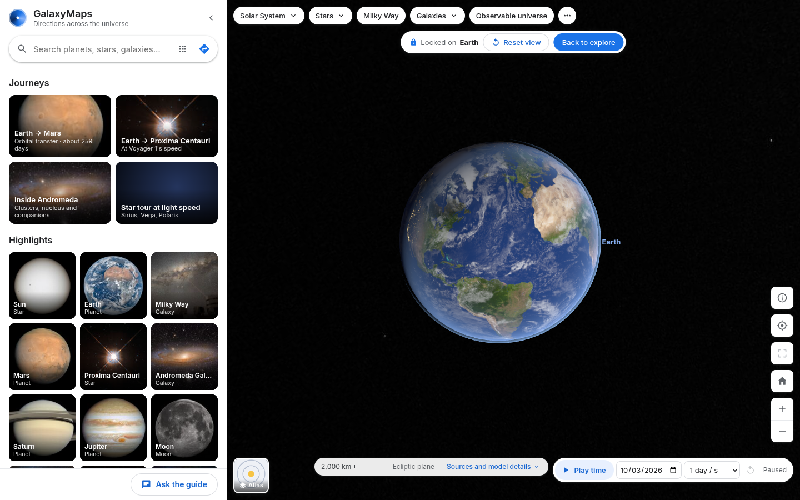

# GalaxyMaps

**Directions across the universe, on a map that feels familiar.**

GalaxyMaps is a continuously zoomable 3D space atlas with a map-app interface. Search for a planet, star, nebula or galaxy, open an image-led destination card, lock the camera onto it and orbit it, then ask for directions. Planet-to-planet trips use an idealized Hohmann transfer orbit; everything else gets a straight-line cruise at light speed or at Voyager 1's measured speed. Every distance comes from a cited catalog, and every model assumption is shown in the interface.

Discover a destination with **Surprise me**, compare verified planet and star diameters, follow four mini-tours or the five-chapter **SpaceX Demo-2** story, and locate eligible objects in an **Earth-centered sky chart**. Save places locally, return to previous views, share the exact object/camera/date or chart, export a credited image card, and use **Quiet view** for a clean presentation.

Built for BigRed//Hacks 2026 (theme: Navigation).

Live site: [galaxy-maps.vercel.app](https://galaxy-maps.vercel.app)

## Demo

[](docs/demo.mp4)

[▶ Watch the demo video](docs/demo.mp4)

[](docs/screenshots/desktop-home-earth.png)

## Quick start

Requirements: Node.js 22 or newer (tested with Node 26) and npm. The smoke test also needs Chromium (`CHROMIUM=/path/to/chrome` if it is not on `PATH` as `chromium`).

```
npm install
npm run dev          # web app on http://localhost:5173, API server on :8787
```

The bundled dataset in `public/data/` is committed, so the app works offline without API keys or data downloads.

| Command                | What it does                                                                                                                                                                                             |
| ---------------------- | -------------------------------------------------------------------------------------------------------------------------------------------------------------------------------------------------------- |
| `npm run dev`          | Vite dev server and API server together (Vite proxies `/api`)                                                                                                                                            |
| `npm run build`        | Typecheck and production build into `dist/`                                                                                                                                                              |
| `npm start`            | Serve `dist/` and the API from one process on `PORT` (default 8787)                                                                                                                                      |
| `npm test`             | Unit tests (projection and locked camera, transfer and travel modes, clock, schematic universe, taxonomy and search, dataset integrity)                                                                  |
| `npm run typecheck`    | TypeScript only                                                                                                                                                                                          |
| `npm run smoke`        | Headless Chromium end-to-end checks against a running dev server (`BASE_URL`, default `http://localhost:5173`; `API_URL`, default `http://localhost:8787`). Add `-- --screenshots` to refresh `docs/screenshots/` |
| `npm run smoke:polish` | Public-UI Chromium checks for comparison/export, all tour/story chapters, saving/sharing, Earth sky, Quiet view and phone/failure paths. Works against the dev server or built app using `BASE_URL`.     |
| `npm run data`         | Re-download all sources, then rebuild the dataset (see [docs/DATA.md](docs/DATA.md))                                                                                                                     |
| `npm run data:build`   | Rebuild the dataset from the cached raw downloads in `data/raw/` (no network)                                                                                                                            |

For a demo laptop, prefer the production build: `npm run build && npm start`, then open <http://localhost:8787>. Run `BASE_URL=http://localhost:8787 npm run smoke:polish` against the built app. The original foundation smoke suite uses development-only instrumentation.

## Credentials (optional)

No credentials are needed for the map, search, browsing, cards, routing, Play time or WebXR.

Grok features need an xAI API key:

```
cp .env.example .env
# edit .env and set XAI_API_KEY=...
npm run dev
```

- The key stays on the server. For Grok Voice, the server requests a short-lived (5-minute) client secret from `POST https://api.x.ai/v1/realtime/client_secrets`, and the browser opens the realtime WebSocket with that token only.
- **Voice control (speech to speech).** Press `M` anywhere, the microphone button beside Mission Control, or "Talk to Grok" in Mission Control. The session stays live while you browse, and a small dock shows whether Grok is listening or speaking, with Mute, Interrupt and End. Grok can operate the app through validated tools only: search and select objects, routes and stops, journeys and tours (start, next, previous, pause, exit), regions, zoom, layer, 3D tilt, orbit, Quiet view, Play time, date and rate, Back, Share, the sky chart, size comparisons, accessibility settings and closing overlays. Say "goodbye" to end it. The app computes every number; Grok explains it.
- **Read-aloud (text to speech).** Listen buttons and "Read replies aloud" use Grok text-to-speech through `POST /api/tts` (voice `XAI_VOICE_NAME`), falling back to the browser's voice if Grok is unavailable. Turn it off or change the speed under Accessibility › Voice.
- **Dictation (speech to text).** The Mission Control microphone records one utterance and transcribes it with Grok through `POST /api/stt`, so it also works in Firefox and Chromium builds without Google speech services.
- **Microphone.** Accessibility › Voice lists your inputs and has a **Test microphone** meter. If an input delivers no sound for a few seconds, the app says so and suggests choosing another device. The microphone needs HTTPS or localhost.
- **Grok Imagine** (Images section of a destination card) generates an image from catalog facts only, labeled **AI reconstruction**, never presented as an observation. Static catalog summaries are never labeled as AI.
- The server rate-limits each endpoint per client (per 10 minutes: 30 voice sessions, 240 speech clips, 400 transcriptions (the VR wake word transcribes each utterance), 120 chat turns, 10 images).

Without a key, the Guide panel provides clearly labeled **scripted explanations and map actions**. Contextual prompts use the selected object's sourced summary, calculated light delay and compatible physical neighbors. Live Grok receives the same validated context; live Voice and Imagine were not exercised without credentials.

## Deploying to Heroku

The repo is a single Node web dyno: `Procfile` runs `npm start`, Heroku's Node buildpack runs `npm run build` automatically, and `.slugignore` keeps raw data, docs and scripts out of the slug. In production the server trusts Heroku's router for client IPs and redirects HTTP to HTTPS (WebXR and the share sheet need a secure context).

```
heroku create galaxymaps
heroku config:set XAI_API_KEY=...          # optional; never commit .env
git push heroku main
heroku domains:add galaxies.wiki
heroku domains:add www.galaxies.wiki
heroku certs:auto:enable                   # automated certificates need a Basic or higher dyno
```

`heroku domains` prints a DNS target for each hostname. At the DNS provider, point `www` at its target with a CNAME and the apex at its target with an ALIAS record.

## Deploying to Vercel

The site is not static: `/api/*` (Grok chat, ephemeral voice tokens, text-to-speech, speech-to-text, image generation, status) runs as a Node serverless function. Vercel does not run Docker containers, so `npm run build:vercel` produces [Build Output API](https://vercel.com/docs/build-output-api/v3) output instead: the Vite build as static files, and the same Express app from `server/index.ts` bundled into one function at `/api`. `vercel.json` already points Vercel at that command.

```
npm i -g vercel
vercel link
vercel env add XAI_API_KEY production     # optional; paste the key when prompted, never commit it
vercel deploy --prod
vercel domains add galaxies.wiki
```

Optional variables (`XAI_CHAT_MODEL`, `XAI_IMAGE_MODEL`, etc. from `.env.example`) are set the same way. Voice works on serverless because the browser connects to xAI directly with a short-lived token from `/api/voice/session`; the key never leaves the function. The request rate limiter is in memory, so on Vercel it applies per function instance rather than globally. To check the output locally, run `npm run build:vercel` and inspect `.vercel/output/`.

## What you can do

### Map and camera

- **Three camera framings.**
  * **Explore**: free pan, zoom and orbit.
  * **Locked**: entered whenever you pick an object (search, map click, Focus, a related card) or press Home. The object's centre becomes the pivot, centred in the part of the map not covered by panels. Dragging orbits with inertia and pitch limits; every form of panning (mouse, keyboard arrows, two-finger drag) is disabled; zoom goes toward the pivot within limits. A "Locked on X" bar offers **Reset view** and **Back to explore**, which restores the view you had before locking.
  * **Route**: framing a set of directions, with a button back to the destination's lock.
- **Home** is a close-up of a textured Earth (day, night lights, clouds), locked.
- **Regions**: grouped pills with dropdowns (Solar System, Stars, Milky Way, Galaxies) plus an overflow menu. The Galaxies group includes Andromeda, the Local Group, nearby galaxies and the Virgo Cluster region.
- **Observable universe**: a transparent bubble with a ~46-billion-light-year comoving radius, labelled "Schematic overview — logarithmic distance", with distance bands instead of a linear scale bar. Its dots are selected catalog objects, not every galaxy. Picking works through the boundary, and selecting an object returns you to its local frame.
- **Rendering**: textured spheres with IAU rotation, Saturn's rings, distinct symbols for black holes, neutron stars, white dwarfs, quasars, clusters and groups, schematic sprites for nebulae and galaxies (galaxies drawn as discs at their catalogued position angle and axis ratio), label collision avoidance, a panoramic sky behind locked objects, and labels and orbits that fade while locked. Two layers share positions, selections and routes: **Realistic** and **Atlas**.
- **Milky Way**: a procedural reconstruction from published spiral-arm models, labelled "Milky Way (reconstruction)", not a photograph.

### Search and browse

- **Search** 919 catalog objects (fuzzy and typo-tolerant across names, aliases, catalog IDs and type words, e.g. "betelgeuze", "M31", "black hole"), plus 109,389 HYG star points. Results show thumbnails and distances. The search box is an ARIA combobox.
- **Browse categories**: a nested tree (eight top-level groups) with real counts. Choosing a category shows a filter chip, emphasizes matching markers on the map, and limits search to that category. Empty categories say "none yet" instead of padding the list.
- Search is entirely local; no online search provider is queried, so there is nothing to debounce or rate-limit.

### Destination cards

- Hero image with an imagery label (Observed image, Scientific illustration, AI reconstruction) and credit/license, plus a gallery and lightbox.
- Name, alternate name, type, parent and category; one sourced summary sentence; 3–6 fact tiles, with a correctly referenced distance first ("Distance from Earth: 0 km · you are here" on Earth; "From Earth on {date}" in the Solar System).
- Actions: **Focus**, **Directions**, **Explore inside** (galaxies, planets with moons, groups), **Compare sizes** where measurements support it, and **View from Earth** where a direction is available. Select the hero to open its gallery.
- Three "Why it's interesting" highlights, related destinations and missions, and expandable **Details**, **Images** and **Sources** sections.
- **Explore inside Andromeda** lists 21 features (companion galaxies, the M31* nucleus, globular clusters, novae, a supernova) with breadcrumbs Universe › Local Group › Andromeda Galaxy.
- **SpaceX and human spaceflight**: 10 cards (Falcon 9, Falcon Heavy, Dragon, Starship, Crew Dragon Demo-2, Inspiration4, Polaris Dawn, the Tesla Roadster, the ISS and Apollo 11), with status and operator. A disclaimer on each says inclusion does not imply endorsement.

### Directions

- **Planet pairs** (for example Earth → Mars): the primary result is an **idealized Hohmann transfer**, about 259 days (shown as "8.5 months") for Earth → Mars, with the next alignment window, departure and arrival dates, Δv and the synodic period. The transfer arc is drawn on the map and can be previewed on its own clock, which pauses Play time. A separate **speed comparison** gives the direct-distance benchmark on the map date.
- **Everything else**: a straight-line cruise with the model outputs spelled out.
- **Travel mode** is a dropdown with exactly two options: **Light speed** and **Voyager 1** (its measured heliocentric speed from JPL Horizons).
- Multi-stop journeys (up to 5 stops) with suggested stops ranked by extra distance.

### Play time

- Play/Pause, Reset and rate presets (1 hour, day, week, month or year per second). The clock starts paused.
- It pauses while you drag, zoom or search and resumes after about 1.2 s of idle if it is still armed. It also pauses when the page is hidden.
- Planets move and spin; a locked moving body stays centred. Reduced-motion preferences are respected.
- Outside the bundled ephemeris window (2026-09-01 to 2027-03-01), positions fall back to two-body orbits, and the time bar marks them as approximate.

### Phone

Floating search at the top, a bottom sheet with collapsed, half and full states, safe-area insets, and pinch-to-zoom and two-finger rotate. The locked object stays centred above the sheet.

### Discovery, comparisons and sharing

- **Compare sizes:** audited mean/equivalent planet and moon diameters, the IAU nominal Sun, and primary-paper Sirius A. True scale preserves the physical ratio; tiny objects have a labeled magnification inset. Fit both explicitly uses independent display scales. Presets include Earth/Jupiter, Earth/Sun, Sun/Sirius A and Earth/Moon.
- **Mini-tours:** Beautiful nebulae, Black holes & extremes, Inside Andromeda and Human spaceflight. Each has Start, Previous/Next, jump, Pause/Resume and return to the previous scene. Their ordering is editorial, not a physical route.
- **Mission story:** five sourced chapters of the completed 2020 SpaceX/NASA Demo-2 mission, with authentic local NASA photographs. The map supplies destination context; no invented flight trajectory is shown.
- **Earth sky:** an interactive stereographic window onto an Earth-centered sky sphere. Solar System directions use the selected epoch; catalog objects disclose J2000/geometric approximations. Angular neighbors are labeled separately from physical proximity. This chart does not predict a local horizon or tonight's visibility.
- **Light delay:** compatible full 3D separation divided by c, or sourced cosmological lookback time. Unknown host depth and unsupported distances withhold a number.
- **Saved & recent:** versioned lightweight browser storage, bounded lists and Undo for unsaving; storage failure keeps a usable session. No account is needed.
- **Exact links:** versioned and validated object/route/layer/epoch/camera state, comparison pair or tour stop, and chart orientation/zoom. Locked cameras use a stable object anchor. Native sharing or clipboard copying has honest feedback and a manual-copy fallback. Localhost links are labeled local; no public deployment exists in this workspace.
- **Quiet view:** the full-screen icon above Home hides panels and map chrome, retains identity/credits and a visible Restore controls button. Escape restores controls before leaving a hidden tour.
- **Map controls (right edge, top to bottom):** About, Share this view, Slowly orbit (while locked) or 3D tilt (while exploring), Quiet view, Home, zoom, Enter VR. Back sits at the left of the time bar once you have history; the Realistic/Atlas layer toggle is in the top-right corner.

### WebXR (immersive VR)

- **Enter VR** appears only when `navigator.xr.isSessionSupported("immersive-vr")` resolves true, and the session starts from a user gesture. There are no extra control bars in VR.
- You stand in the same 3D map as the web view: nearby objects stay on a true linear scale; farther stars and galaxies keep their real directions and angular sizes, with log-compressed depth so Andromeda, Virgo and a distant quasar sit at different depths. Galaxies and nebulae are thick particle volumes (not camera-facing photos). Pinch something to fly there like a ship.
- **Look** with your head (web pages do not get eye tracking). **Pinch** what you are looking at to fly there; pinch and drag to turn around it; spread two pinching hands or push one hand to zoom. A Quest thumbstick does the same. Names sit on the object; hitboxes are large enough for coarse head gaze.
- **Hold your gaze** about half a second (a ring fills) to open details; a quick pinch does the same. Looking away closes the card.
- **Grok Voice** is hands-free: the microphone is always listening, but only an utterance that starts with "Grok" (for example "Grok, take me to Saturn") is sent; anything else is ignored. Saying just "Grok" waits a few seconds for the command. Speech is detected locally, then transcribed through `/api/stt`, so the realtime session only receives addressed commands. A small status pill sits head-locked at the bottom center of the view. Grok replies once and does not narrate travel; the destination is rotated in front of where you were looking when you asked.
- **Performance in VR:** particle galaxies are built in a Web Worker, overlapping particle models share one fill budget and are frustum-culled, labels are re-chosen a few times per second, and the star buffer only re-centres when float precision needs it. Not yet profiled on a headset.
- Leave VR with the system gesture. **Headset validation pending**: math and session lifecycle are tested; a physical Vision Pro / Quest pass is still needed.

**Testing on a headset.** WebXR requires a secure context:

- **Quest over USB**: run `npm run build && npm start`, then `adb reverse tcp:8787 tcp:8787`, and open `http://localhost:8787` in the Quest browser (localhost counts as secure).
- **Any headset on the network**: put the production server behind a trusted HTTPS endpoint you control, such as a tunnel or reverse proxy with a valid certificate, and open that URL. No public deployment exists for this project; use your own.

### Keyboard

| Key        | Action                                                                                        |
| ---------- | --------------------------------------------------------------------------------------------- |
| `/`        | Focus search                                                                                  |
| `+` / `-`  | Zoom in / out (toward the pivot when locked)                                                  |
| Arrow keys | Orbit when locked, pan in Explore                                                             |
| `H`        | Home (Earth close-up, locked)                                                                 |
| `R`        | Reset view                                                                                    |
| `F`        | Fit the current route                                                                         |
| `L`        | Toggle Realistic / Atlas layer                                                                |
| `M`        | Start or end voice control with Grok                                                          |
| `D`        | Directions (to the selected place)                                                            |
| `Space`    | Play / pause time                                                                             |
| `Esc`      | Close the active dialog/chart/comparison or restore Quiet view, then menus, camera and panels |

## Scientific model and assumptions

- **Positions.**
  * Frame: Sun-centered ICRF coordinates in kilometres (float64).
  * Solar System bodies: NASA/JPL Horizons vectors for 2026-09-01 to 2027-03-01, interpolated by date. Moons use osculating elements relative to their planet. Outside the window, two-body orbits are used and marked approximate.
  * Stars: HYG v4.4 coordinates, or SIMBAD parallaxes and literature distances for featured stars.
  * Galaxies: published redshift-independent distances. Galaxy features have measured sky positions but unmeasured depth, and the Explore-inside view says so.
- **Hohmann transfer (planet pairs).** Circular, coplanar orbits with radii equal to the Horizons semi-major axes: `a = (r₁ + r₂)/2`, `t = π√(a³/μ☉)`. Earth → Mars: about 259 days; alignment windows about 780 days apart. It is not a launch-ready mission design.
- **Straight-line cruise (everything else).** `distance = |destination − origin|` in full 3D and `time = distance / speed`. It ignores acceleration, gravity and target motion. It is not a flight plan.
- **Parallaxes.** A parallax is inverted only when its relative error is ≤ 20%. Otherwise the object stays searchable and explains why no route is offered (for example Alnilam, at 27%).
- **Cosmology.** Objects at cosmological redshift are searchable but not routable: expansion makes a fixed-speed trip undefined. The observable-universe view is schematic, with a logarithmic distance axis.
- **Voyager 1 speed.** Heliocentric speed from JPL Horizons on a stated date (16.92 km/s). A spacecraft has no single travel speed, and the UI says so.
- **Display vs. physics.** Markers are enlarged for visibility; this never affects distances. The map plane blends from the ecliptic (Solar System) to the galactic plane.

## Catalog (as built)

From `npm run data:build`:

- 919 catalog objects, of which 374 are featured destinations, plus 109,389 HYG stars within 1,000 pc.
- 126 highlights: Solar System 24, stars 16, compact objects 12, clusters 10, nebulae 18, galaxies 26, structures 6, missions 14.
- 68 galaxies, 21 Andromeda features, 10 SpaceX and human-spaceflight cards.
- 274 hero images, 479 additional gallery references and 65 source records, including the newly audited local NASA/EHT assets. Provenance: [content manifest](docs/polish/content-manifest.md).

## Limitations

- **Headset validation pending.** WebXR has not been run on a physical headset or visionOS Simulator. Session ownership, exact return, gesture handling and renderer teardown are tested separately. Current upstream documentation and the remaining device checklist: [XR status](docs/polish/xr-status.md).
- **Live Grok untested here.** The Grok Voice and Imagine integrations follow the xAI documentation, but no key was configured during development.
- **Ephemeris window.** Precise positions cover 2026-09-01 to 2027-03-01; outside it, two-body orbits are approximate.
- **Images.** Gallery images come from each object's Wikipedia page. Images that don't mention the object are filtered out at build time, which removes images from navigation templates.
- **Bundle size.** Three.js and the catalog UI exceed Vite's 500 kB advisory. Actual final build sizes and software-rendered browser evidence are recorded in [the completion report](docs/COMPLETION-REPORT.md); no GPU performance result is claimed.

## Project layout

```
src/lib/        Pure, tested science modules: units, coords, physics, route, transfer, transport, search, taxonomy
src/map/        Three.js map engine (projection, locked camera, labels, flights, sky, Milky Way, universe schematic)
src/state/      Zustand store, actions, clock, menus, URL sync
src/ui/         React sidebar, cards, directions, map chrome
src/xr/         WebXR immersive-vr presentation
src/ai/         Validated tool layer, Grok Voice client, shared audio/microphone capture, offline scripted guide
server/         Express: /api/status, /api/voice/session, /api/tts, /api/stt, /api/chat, /api/imagine; serves dist/ in production
scripts/data/   Reproducible data pipeline (fetch → data/raw, build → public/data)
scripts/        smoke.ts (end-to-end checks), shot.ts (one-off screenshots)
docs/           Architecture, data, demo script, completion report
```

More detail: [docs/ARCHITECTURE.md](docs/ARCHITECTURE.md), [docs/DATA.md](docs/DATA.md), [docs/DEMO.md](docs/DEMO.md), [docs/COMPLETION-REPORT.md](docs/COMPLETION-REPORT.md).

## Data sources and credits

- NASA/JPL Horizons (DE441) for Solar System positions and spacecraft speeds; JPL SBDB for small bodies.
- NASA Planetary Fact Sheets (NSSDCA) for planet facts.
- HYG Database v4.4 by Astronexus (CC BY-SA 4.0) for star positions.
- SIMBAD, CDS Strasbourg, for parallaxes, identifiers and morphology.
- NASA Exoplanet Archive (Planetary Systems Composite Parameters) for exoplanets.
- Literature distances cited per card (for example GRAVITY Collaboration 2019 for Sgr A*, Pietrzyński et al. 2019 for the LMC).
- Solar System Scope textures (CC BY 4.0, based on NASA imagery); NASA SVS Deep Star Maps 2020 for the sky panorama.
- Wikipedia and Wikimedia Commons for summaries (CC BY-SA 4.0) and images; license and credit are shown per image.

GalaxyMaps is not affiliated with Google. The map-app interaction model is a familiar reference only; no Google imagery, logos or interface assets are used.
