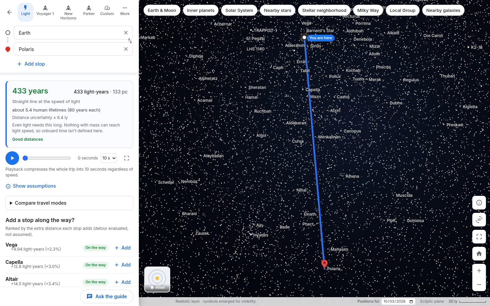

# SpaceMaps

**Explore the universe through a familiar, interactive map.**

SpaceMaps is a continuously zoomable space atlas and journey simulator with a Google-Maps-style interface. Search for a planet, star or galaxy, ask for directions from Earth, and compare how long the trip would take at light speed, at a real spacecraft's speed, or at a speed you choose. Every distance comes from a real catalog, and every assumption is shown in the interface.

Built for BigRed//Hacks 2026 (theme: Navigation).



## Quick start

Requirements: Node.js 22 or newer (tested with Node 26) and npm. The smoke test also needs Chromium (`CHROMIUM=/path/to/chrome` if it is not on `PATH` as `chromium`).

```bash
npm install
npm run dev          # web app on http://localhost:5173, API server on :8787
```

Open the URL Vite prints. The bundled dataset in `public/data/` is committed, so the app works offline without any API keys or data downloads.

| Command | What it does |
| --- | --- |
| `npm run dev` | Vite dev server and API server together (Vite proxies `/api`) |
| `npm run build` | Typecheck and production build into `dist/` |
| `npm start` | Serve `dist/` and the API from one process on `PORT` (default 8787) |
| `npm test` | Unit tests (physics, coordinates, dataset integrity, camera flight) |
| `npm run typecheck` | TypeScript only |
| `npm run smoke` | Headless Chromium smoke test against a running server (`BASE_URL`, default `http://localhost:8787`; add `-- --screenshots` to refresh `docs/screenshots/`) |
| `npm run data` | Re-download all sources, then rebuild the dataset (see [docs/DATA.md](docs/DATA.md)) |
| `npm run data:build` | Rebuild the dataset from the cached raw downloads in `data/raw/` (no network) |

For a demo laptop, prefer the production build: `npm run build && npm start`, then open http://localhost:8787.

## Credentials (optional)

No credentials are needed for the map, search, routing, calculations, playback, multi-stop journeys or the Mars transfer demo.

Grok features need an xAI API key:

```bash
cp .env.example .env
# edit .env and set XAI_API_KEY=...
npm run dev
```

- The key stays on the server. For Grok Voice, the server requests a short-lived (5-minute) client secret from `POST https://api.x.ai/v1/realtime/client_secrets`, and the browser opens the realtime WebSocket with that token only.
- **Grok Voice** ("Talk to Grok" in the Guide panel): speech in and out over the xAI realtime API. Grok can only call SpaceMaps' validated tools (search the catalog, show an object, set a route, add a stop, compare modes, explain the journey, suggest stops). The app computes every number; Grok explains it.
- **Grok Imagine** ("AI view" on a destination card): generates an image from catalog facts only, labeled **AI reconstruction**, never presented as an observation.
- The server rate-limits both endpoints (30 voice sessions and 10 images per 10 minutes) so a demo can't run up the bill.

Without a key, the Guide panel says so plainly and falls back to an **offline scripted guide**: keyword matching that calls the same validated tools, labeled "Offline guide (scripted)" and "not an AI model". Browser dictation and read-aloud are also available and labeled as browser speech, not Grok.

> ChatGPT, Claude or Cursor subscriptions do not provide runtime API access. Grok features need an xAI API key with credit.

## What you can do

- **Zoom continuously** from the Earth–Moon system out to the Solar System, nearby stars, the stellar neighborhood, the Milky Way, the Local Group and nearby galaxies. Use the scale chips across the top of the map, the mouse wheel, or the keyboard.
- **Search** 618 catalog objects (fuzzy and typo-tolerant, e.g. "betelgeuze"), plus 109,389 star points from HYG.
- **Read a destination card**: image with an imagery label (Observed image, Scientific illustration or AI reconstruction) and credit/license; distance with uncertainty, quality and the citation; sourced facts; exoplanets; and a Wikipedia summary.
- **Get directions**: the straight-line 3D distance and the time at constant speed. Modes are light, Voyager 1, New Horizons, Parker Solar Probe peak speed and a custom speed, plus sci-fi and everyday modes under **More**.
- **Relativity**: for 0 < v < c, the traveler's onboard time is shown alongside Earth time. It is never shown at or above light speed.
- **Multi-stop journeys** (up to 5 stops): add, remove and reorder stops. Suggested stops are ranked by the measured extra distance; "On the way" means the detour adds at most 5%.
- **Journey playback**: a 5–40 second animation, independent of the travel speed.
- **Mars transfer demo**: an idealized Earth→Mars Hohmann transfer (about 259 days) with moving planets and all assumptions listed.
- **Two visual layers**: Realistic (planet textures and a star field) and Atlas (clean symbols, orbits, spiral-arm labels). Both share the same positions, selections and routes.
- **Shareable URLs**: `?route=earth,vega,polaris&mode=voyager-1-speed`, `?place=saturn`, `?panel=transfer`, `?view=milky-way&layer=atlas`.

### Keyboard

| Key | Action |
| --- | --- |
| `/` | Focus search |
| `+` / `-` | Zoom in / out |
| Arrow keys | Pan |
| `H` | Back to Earth |
| `F` | Fit the current route |
| `L` | Toggle Realistic / Atlas layer |
| `D` | Directions (to the selected place) |
| `Esc` | Close the current panel |

Reduced-motion preferences are respected: camera flights become instant cuts.

## Scientific model and assumptions

- **Positions.**
  - Frame: Sun-centered ICRF coordinates in kilometres (float64).
  - Solar System bodies: NASA/JPL Horizons vectors for 2026-09-01 to 2027-03-01, interpolated by date. Moons use osculating elements relative to their planet.
  - Stars: HYG v4.4 Cartesian coordinates, or SIMBAD parallaxes and literature distances for featured stars.
  - Galaxies: published redshift-independent distances.
- **Cruise comparison.**
  - `distance = |destination − origin|` in full 3D, even though the map is a 2D projection, and `time = distance / speed`.
  - This is a hypothetical constant-speed comparison. It ignores acceleration, braking, gravity and the targets' own motion. It is not a flight plan and never claims to be the fastest route.
- **Parallaxes.** A parallax is inverted only when its relative error is ≤ 20%. Otherwise the object stays searchable but explains why no route is offered.
  - HYG's ≥ 100,000 pc sentinel is treated as missing data.
  - HYG stars beyond 100 pc are drawn but not routable, because HYG does not tabulate their uncertainty.
- **Cosmology.** Quasars at cosmological redshift (3C 273, TON 618) are searchable but not routable. Their distance depends on the cosmological definition, and expansion makes a fixed-speed trip undefined. Intergalactic routing is limited to the Local Group and Local Volume (z < 0.005).
- **Spacecraft speeds.** These are heliocentric speeds from JPL Horizons on a stated date (Parker's is its 2024-12-24 perihelion peak). A rocket has no single travel speed, and the UI says so.
- **Fiction.** Enterprise (warp 9 ≈ 1,516× c, TNG scale) and Millennium Falcon speeds are labeled fictional, adjustable story assumptions.
- **Relativity.** `τ = t·√(1 − v²/c²)` for 0 < v < c only, with acceleration excluded.
- **Hohmann transfer.**
  - Model: circular, coplanar orbits with radii equal to the Horizons semi-major axes; `a = (r₁ + r₂)/2`, `t = π√(a³/μ☉)`.
  - Results: about 259 days, Mars about 44° ahead at launch, synodic period of about 780 days.
  - This is explicitly not a launch-ready mission for an arbitrary date.
- **Display vs. physics.** Planet and star markers are enlarged for visibility, and that never affects distances. The map plane blends from the ecliptic (Solar System) to the galactic plane (beyond ~150 pc). The Milky Way disk is a procedural scientific illustration based on published spiral-arm models, labeled as such; it is not a photograph.

## Limitations

- **Live Grok untested.** The Grok Voice and Imagine integrations are implemented against the xAI documentation, but this team has not exercised them with a live key yet (none was configured during development).
- **Ephemeris window.** The bundled ephemeris covers 2026-09-01 to 2027-03-01. Dates outside it are clamped, and the date picker enforces the range.
- **Undefined routes.** Three featured objects are not routable, by design: Alnilam (parallax too uncertain), 3C 273 and TON 618 (cosmological).
- **Images.** 66 of the 105 featured destinations have a lead image. Stars mostly lack one, because their Wikipedia lead images are constellation charts, which we intentionally skip.
- **Bundle size.** The JS bundle is about 900 kB (about 250 kB gzipped), and the media folder is about 30 MB.

## Project layout

```
src/lib/        Pure, tested science modules: units, coords, physics, route, itinerary, transfer, search, format
src/map/        Three.js map engine (camera-relative rendering, labels, flights, Milky Way model)
src/state/      Zustand store, derived selectors, URL sync
src/ui/         React sidebar panels and map chrome
src/ai/         Validated tool layer, Grok Voice client, offline scripted guide
server/         Express: /api/status, /api/voice/session, /api/imagine; serves dist/ in production
scripts/data/   Reproducible data pipeline (fetch → data/raw, build → public/data)
scripts/smoke.ts Headless browser smoke test
docs/           Architecture, data, demo scripts, Devpost copy, deck, submission checklist
```

More detail: [docs/ARCHITECTURE.md](docs/ARCHITECTURE.md) (stable interfaces), [docs/DATA.md](docs/DATA.md) (sources and pipeline), [docs/DEMO.md](docs/DEMO.md), [docs/SUBMISSION.md](docs/SUBMISSION.md).

## Data sources and credits

- NASA/JPL Horizons (DE441) for Solar System positions, spacecraft and speeds.
- NASA Planetary Fact Sheets (NSSDCA) for planet facts.
- HYG Database v4.4 by Astronexus (CC BY-SA 4.0) for star positions.
- SIMBAD, CDS Strasbourg, for featured-star parallaxes and identifiers.
- NASA Exoplanet Archive (Planetary Systems Composite Parameters) for exoplanets.
- Literature distances cited by ADS bibcode on each card: GRAVITY Collaboration 2019 (Sgr A*), Pietrzyński et al. 2019 (LMC), Graczyk et al. 2020 (SMC), and others.
- Solar System Scope textures (CC BY 4.0, based on NASA imagery).
- Wikipedia/Wikimedia Commons for summaries (CC BY-SA 4.0) and lead images. The license and credit are shown per image.

SpaceMaps is not affiliated with Google. "Google Maps" is referenced only to describe the familiar interaction model.
